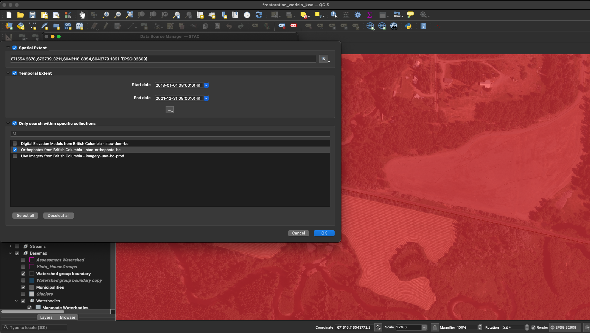

```{r setup, echo=FALSE, include = TRUE}
knitr::opts_chunk$set(echo=TRUE, message=FALSE, warning=FALSE, dpi=60, out.width = "100%")

```


```{r, echo=FALSE, include = T}
staticimports::import()
source('scripts/staticimports.R')
source('scripts/functions.R')
```


```{r build, echo= FALSE, eval = FALSE}
# we need to chabge the rmd_on param to FALSE to render the README.md for the github landing page
rmarkdown::render(
  "README.Rmd", 
  output_format = "github_document", 
  params = list(rmd_on = FALSE, update_query = TRUE)
  )

rmarkdown::render(
  "README.Rmd", 
  output_format = "html_document", 
  output_file = "index.html", 
  params = list(rmd_on = TRUE, update_query = FALSE)
  )
```

<!-- README.md is generated from README.Rmd. Please edit that file -->


The goal of [`stac_orthophoto_bc`](https://github.com/NewGraphEnvironment/stac_orthophoto_bc) is to serve the British Columbia lidarBC digital elevation model collection.  It can be queried by location and/or time using our API via the lovely [`rstac` R package](https://brazil-data-cube.github.io/rstac/)
and [QGIS (v3.42+)](https://qgis.org/).  Still a work in progress but currently functioning at [https://images.a11s.one](https://images.a11s.one).
See below how to add STAC items to QGIS.

<br>

This work leverages work sister repos [`stac_uav_bc`](http://www.newgraphenvironment.com/stac_uav_bc) and [`stac_dem_bc`](http://www.newgraphenvironment.com/stac_dem_bc) with the registration of the stac done with scripts [here](https://github.com/NewGraphEnvironment/stac_uav_bc/blob/main/scripts/web.R) and [here](https://github.com/NewGraphEnvironment/stac_uav_bc/tree/main/scripts/config).

<br>

```{r fig, echo=FALSE, out.width="100%", fig.align="center"}

fpr::fpr_photo_resize_convert("fig/cover.png", path = "fig")
knitr::include_graphics("fig/cover.JPG")
```

<br>

Here we will use [`bcdata`](https://github.com/bcgov/bcdata) (indirectly through our Reproducible Field Projects [`rfp`](https://www.newgraphenvironment.com/rfp/) package) to give us the Richfield Creek [freshwater atlas assessment watershed](https://catalogue.data.gov.bc.ca/dataset/freshwater-atlas-assessment-watersheds/resource/57b84cf3-8330-4805-abb6-aaf27e6c64c0)  - then query the `stac-orthophoto-bc` collection for all the DEMs that land in that watershed group for the timeframe between 2018 and 2021. 

```{r api1, eval=params$update_query}

aoi <- rfp::rfp_bcd_get_data(
  "whse_basemapping.fwa_assessment_watersheds_poly",
  col_filter = "gnis_name_1",
  col_filter_value = "Richfield Creek"
) |> 
  sf::st_transform(crs = 4326)

# we don't use this but could feed to the `bbox` param
bbox <- aoi |> 
  sf::st_bbox() |> 
  as.numeric()

date_start <- "2018-01-01T00:00:00Z"
date_end <- "2021-12-31T00:00:00Z"

# use rstac to query the collection
q <- rstac::stac("https://images.a11s.one/") |>
  rstac::stac_search(
    collections = "stac-orthophoto-bc",
    # bbox = bbox,
    intersects = jsonlite::fromJSON(
      geojsonsf::sf_geojson(
        aoi, atomise = TRUE, simplify = FALSE
      ),
      simplifyVector = FALSE
      # ugly but just grabs the geometry list item using the new pipe
    ) |> (\(x) x$geometry)(),
    datetime = paste0(date_start, "/", date_end)
  ) |>
  rstac::post_request()

# get deets of the items
r <- q |>
  rstac::items_fetch()

# burn the results locally so we can serve it instantly on index.html builds
# Save to RDS file
saveRDS(r, "data/stac_result.rds")
```


```{r}
r <- readRDS("data/stac_result.rds")
# build the table to display the info
tab <- tibble::tibble(url_download = purrr::map_chr(r$features, ~ purrr::pluck(.x, "assets", "image", "href"))) |> 
  dplyr::mutate(
    link_download = ngr::ngr_str_link_url(url_base = url_download, anchor_text = url_download)
  ) |> 
  dplyr::select(link_download)
```

<br>

`r if (params$rmd_on == FALSE) "Please see http://www.newgraphenvironment.com/stac_dem_bc for published table of collection links/details."`


```{r tab1-cap, echo=FALSE, results="asis", eval=identical(params$rmd_on, TRUE)}
my_caption <- "Orthophoto download links."

my_tab_caption_rmd(tip_flag = FALSE)
```


```{r tab1, echo=FALSE, eval=identical(params$rmd_on, TRUE)}
tab |> 
  my_dt_table(cols_freeze_left = 2, escape = FALSE)
```


As of QGIS 3.42 - ONE can also access stac items (orthoimagery, Digital Surface Models and Digital Terrain Models in our case) directly via
the Data Source Manager. See a blog with details [here](https://www.lutraconsulting.co.uk/blogs/stac-in-qgis).  It looks like this in the 
th `Layer / Data Source Manager` toolbar in QGIS:

```{r echo=FALSE, fig.cap="Connecting to https://images.a11s.one"}

```

```{r echo=FALSE, fig.cap= "Using the field of view in QGIS to filter results"}
knitr::include_graphics("fig/a11sone02.png")
```

