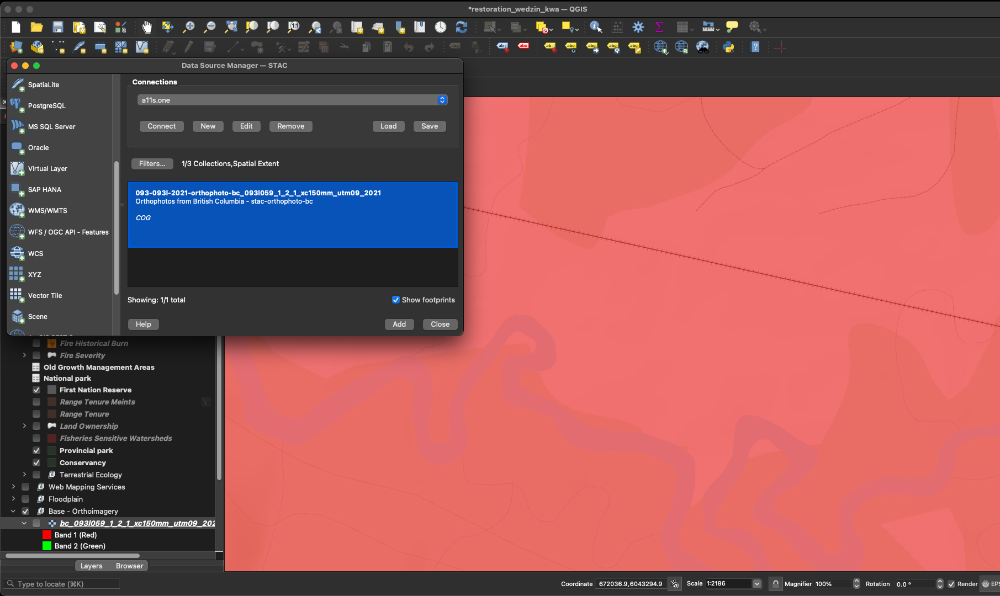

stac_dem_bc
================

<!-- README.md is generated from README.Rmd. Please edit that file -->


The goal of
[`stac_dem_bc`](https://github.com/NewGraphEnvironment/stac_dem_bc) is
to serve the British Columbia lidarBC digital elevation model
collection. It can be queried by location and/or time using our API via
the lovely [`rstac` R
package](https://brazil-data-cube.github.io/rstac/) and [QGIS
(v3.42+)](https://qgis.org/). Still a work in progress but currently
functioning at <https://images.a11s.one>. See below how to add STAC
items to QGIS.

<br>

This work leverages work in a sister repo
[`stac_uav_bc`](http://www.newgraphenvironment.com/stac_uav_bc) with the
registration of the stac done with scripts
[here](https://github.com/NewGraphEnvironment/stac_uav_bc/blob/main/scripts/web.R)
and
[here](https://github.com/NewGraphEnvironment/stac_uav_bc/tree/main/scripts/config).

<br>


<br>

Here we will use [`bcdata`](https://github.com/bcgov/bcdata) (indirectly
through our Reproducable Field Projects
[`rfp`](https://www.newgraphenvironment.com/rfp/) package) to give us
the Bulkley River watershed group - then query the `stac-dem-bc`
collection for all the DEMs that land in that watershed group for the
timeframe between 2018 and 2020.

``` r
aoi <- rfp::rfp_bcd_get_data(
  "whse_basemapping.fwa_watershed_groups_poly",
  col_filter = "watershed_group_name",
  col_filter_value = "Bulkley River"
) |> 
  sf::st_transform(crs = 4326)

# we don't use this but could feed to the `bbox` param
bbox <- aoi |> 
  sf::st_bbox() |> 
  as.numeric()

date_start <- "2018-01-01T00:00:00Z"
date_end <- "2020-12-31T00:00:00Z"

# use rstac to query the collection
q <- rstac::stac("https://images.a11s.one/") |>
  rstac::stac_search(
    # collections = "imagery-uav-bc-dev",
    collections = "stac-dem-bc",
    # bbox = bbox,
    intersects = jsonlite::fromJSON(
      geojsonsf::sf_geojson(
        aoi, atomise = TRUE, simplify = FALSE
      ),
      simplifyVector = FALSE
      # ugly but just grabs the geometry list item using the new pipe
    ) |> (\(x) x$geometry)(),
    datetime = paste0(date_start, "/", date_end)
  ) |>
  rstac::post_request()

# get deets of the items
r <- q |>
  rstac::items_fetch()

# burn the results locally so we can serve it instantly on index.html builds
# Save to RDS file
saveRDS(r, "data/stac_result.rds")
```

``` r
r <- readRDS("data/stac_result.rds")
# build the table to display the info
tab <- tibble::tibble(url_download = purrr::map_chr(r$features, ~ purrr::pluck(.x, "assets", "image", "href"))) |> 
  dplyr::mutate(
    link_download = ngr::ngr_str_link_url(url_base = url_download, anchor_text = url_download)
  ) |> 
  dplyr::select(link_download)
```

<br>

Please see <http://www.newgraphenvironment.com/stac_dem_bc> for
published table of collection links/details.

As of QGIS 3.42 - ONE can also access stac items (orthoimagery, Digital
Surface Models and Digital Terrain Models in our case) directly via the
Data Source Manager. See a blog with details
[here](https://www.lutraconsulting.co.uk/blogs/stac-in-qgis). It looks
like this in the th `Layer / Data Source Manager` toolbar in QGIS:

<div class="figure">


<p class="caption">

Connecting to <https://images.a11s.one>
</p>

</div>

<div class="figure">


<p class="caption">

Using the field of view in QGIS to filter results
</p>

</div>
